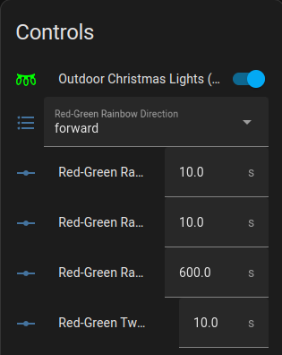

# Custom ESPHome LED Effects (Addressable Lambdas)!

These effects are customizable, _adding entities/components_ to your
ESPHome device to change the behavior of the LED effects!



# Installation

Symlink or copy these files into your ESPHome build directory, then in
your configuration YAML(s):

```yaml
packages:
  custom_addressable_lambdas: !include /PATH/TO/custom_addressable_lambdas.include.yaml

# under your light...
light:
  - platform: neopixelbus  # or whatever you are using
    # ...
    effects:
      # other effects here
      - addressable_lambda:
          name: "Red-Green Rainbow"
          update_interval: ${addressable_lambda_update_interval_ms}ms
          lambda: |-
            red_green_rainbow(it, current_color, initial_run);
      - addressable_lambda:
          name: "Red-Green Twinkle"
          update_interval: ${addressable_lambda_update_interval_ms}ms
          lambda: |-
            red_green_twinkle(it, current_color, initial_run);
      - addressable_lambda:
          name: "Red-Green Rainbow/Twinkle Cycle"
          update_interval: ${addressable_lambda_update_interval_ms}ms
          lambda: |-
            red_green_rainbow_twinkle_cycle(it, current_color, initial_run);
```

As you can see, this adds three effects:
- red-green rainbow
- red-green twinkle
- and an effect that cycles between them at some interval.

# Changing the Refresh Rate

The default refresh interval is 50ms (20 Hz). If you want to change
this, change the value in `addressable_lambda_refresh.include.yaml`
(or simply define your own `addressable_lambda_update_interval_ms`
`substitution` in milliseconds (as an integer-string -- this value is
included in both YAML _and_ C++ code via `globals`).

# Acknowledgements

## Adaptations

This code was adapated from:
- https://community.home-assistant.io/t/share-your-esphome-light-effects/250294/14

## Other Projects

See also the following on GitHub:
- https://github.com/soundstorm/esphome_led_effects
- https://github.com/tallSequoia/ESPHomeLights
